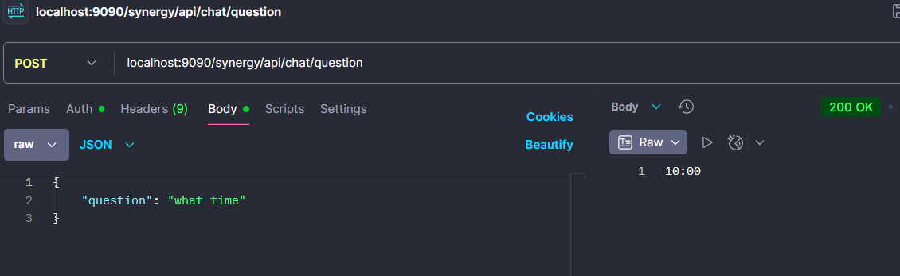
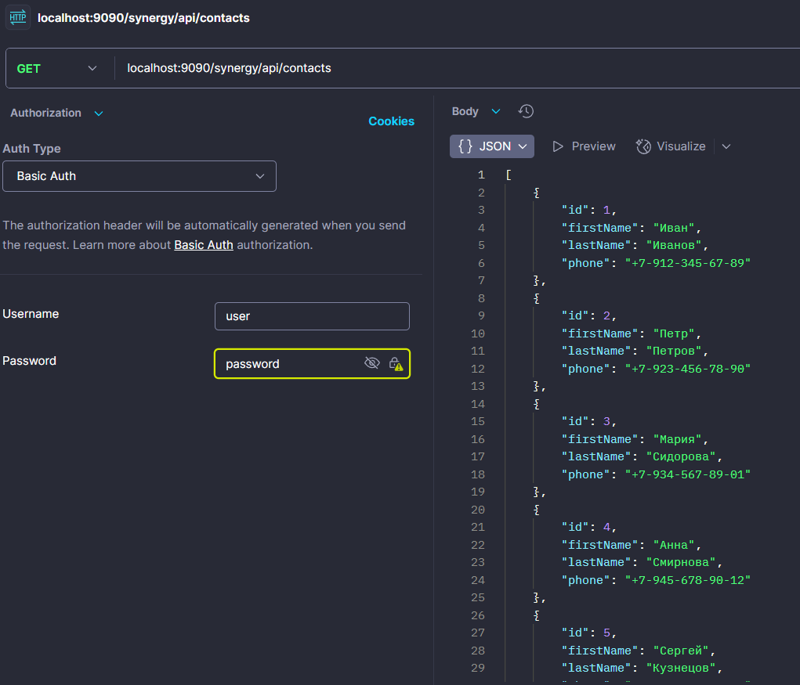

## Java Spring Homework


### Description

Project with application on Spring. The Goal of this
project is to improve my Spring knowledge.
All tasks completed according to the `Synergy University`
tasks.

### Task 1:

Create an application using `Spring IoC` to
get acquainted with the basic functionality of `IoC`,
on which all `Spring` is built.

1) You need to create a simple application (mini chat bot) on `Spring`,
   which will output a list of contacts to the console.
2) Using notepad, create a file contacts.csv and
   add 5 people there. Last name, first name, middle name,
   phone number. Save as a `CSV` file ("Save as..."
   write "contacts.csv" and click "save")
   The contents of the file should be something like this:
```text
LastName,FirstName,MiddleName,Phone
Leonov,Alexey,Vladimirovich,79990190299
Ivanov,Oleg,Petrovich,79530191296
Stepanov,Petr,Ivanovich,79881233245
Petrakov,Alexandr,Alexeyevich,79532111296
Ivanova,Oksana,Vladimirocna,79522191213
```
3) To read the file, you need to apply the annotation `@Value`, 
having previously read the documentation on the official
website of `Spring`.
4) Create a new interface `ContactService` and its implementation
`ContactServiceCsvImpl`. The name of the method for finding contacts
should be `findAll()`. The implementation should contain all the logic
for reading and processing contacts in the `CSV` file
5) All dependencies should be configured in the `IoC` container
6) In the console, you need to display a list of contacts in the following
format: "LastName FirstName MiddleName, Phone"
7) The application
   should be correctly launched using `java -jar`

### Task 2:

1) Need to connect `Spring MVC` starter to the project
2) Create `CRUD REST API` application for `ContactService` service
3) Create a controller for receiving random user data. 
Call it `UserController`
4) Add several spring profiles. There should be `dev`, `test`, `prod`.
   Implement the launch of each profile on different ports.
5) All dependencies should be configured in the `IoC` container
6) Optional task with an asterisk*: need to
   add caching to `ContactService`. (`spring caching`)

### Task 3:

1) Write integration tests for the `UserController` (`JokeController`)
2) Write unit tests for the `CRUD REST API` of the
   `ContactService` service, which we did in the
   previous homework
3) Write `mvc` tests for `ContactController`, which
   we did in the previous homework
4) Fix all the sonar
   errors that you have in the project. 
Search using the plugin in `IDEA SonarLint` 
with the default configuration.

### Task 4:

1) Need to include `Spring Data` starter in the project
2) Create entity `Contact` and repository `ContactRepository`
3) Write tests for `ContactRepository`
4) Include `Lombok` and use its annotations in the project

### Task 5:

1) Add annotation
   `@EnableTransactionManagement` in the project
2) Add transactions for all operations
   in `ContactServiceImpl`
3) Use your own class for exception
   in case of an error in the transaction

### Task 6:

1) Connect starters and configuration
   `SecurityConfig` for the security system
2) Protect `ContactContoller` methods
3) For the method for deleting contacts, add
   `@PreAuthorize` `("hasRole('ADMIN')")`
4) Make authentication using the database

### Task 7:

1) Create 2 topics `chat-producer-topic` and 
`chat-consumer-topic`
2) Add service-message handler
with name `ChatService` and `ChatServiceImpl`
3) Create logic answer-question to inbox.
Example: What time? Answer: 10:00

### Task 8:

1) Add additional methods to Gateway for `ChatServiceImpl`
2) Configure application security at the Gateway level.


### `contact-service` structure :

```text
src
├──/main/java/io/mkalugin/synergy/
│    ├── client
│    │     └── JokeClient.java
│    ├── config
│    │     ├── AppConfig.java
│    │     ├── DataInitializer.java
│    │     ├── KafkaConfig.java
│    │     ├── SecurityConfig.java
│    │     └── FeignConfig.java
│    ├── controller  
│    │     ├── ChatController.java
│    │     ├── ContactController.java
│    │     └── Joke.java
│    ├── dto
│    │     ├── MessageDto.java
│    │     ├── ContactDto.java
│    │     └── JokeDto.java
│    ├── exception
│    │     ├── ContactLoadingException.java 
│    │     └── TransactionalException.java 
│    ├── model
│    │     ├── Role.java
│    │     ├── User.java
│    │     └── Contact.java 
│    ├── repository
│    │     ├── RoleController.java
│    │     ├── UserController.java
│    │     └── ContactRepository.java 
│    ├── service
│    │     ├── ChatService.java
│    │     ├── ChatServiceImpl.java 
│    │     ├── CustomUserDetailsService.java
│    │     ├── ContactService.java
│    │     ├── ContactServiceImpl.java 
│    │     ├── JokeService.java
│    │     └── JokeServiceImpl.java    
│    └── SynergyApplication.java
└──/test/java/io/mkalugin/synergy/
     ├── kafka
     │     ├── ChatServiceKafkaTest.java
     ├── controller
     │     ├── ContactControllerTest.java
     │     └── JokeControllerTest.java
     ├── repository
     │     └── ContactRepositoryTest.java
     └── service
           └──ContactServiceImplTest.java
```

### Run jar file:

```bash
    mvn clean package
    java -jar target/synergy-0.0.1-SNAPSHOT.jar
```

### Run App with profiles:

```bash
    mvn spring-boot:run -D"spring-boot.run.profiles=dev"
    mvn spring-boot:run -D"spring-boot.run.profiles=test"
    mvn spring-boot:run -D"spring-boot.run.profiles=prod"
```

### SonarQube errors:


#### Console output (Task 2 realization):


### Create contact in DB :


### Request via Gateway:





### Usefull links :

[Spring Resources](https://docs.spring.io/spring-framework/reference/core/resources.html)

[Spring Transactions](https://habr.com/ru/articles/682362/)

[Spring Cloud with Kafka](https://habr.com/ru/articles/552448/)

### Author : Maxim Kalugin