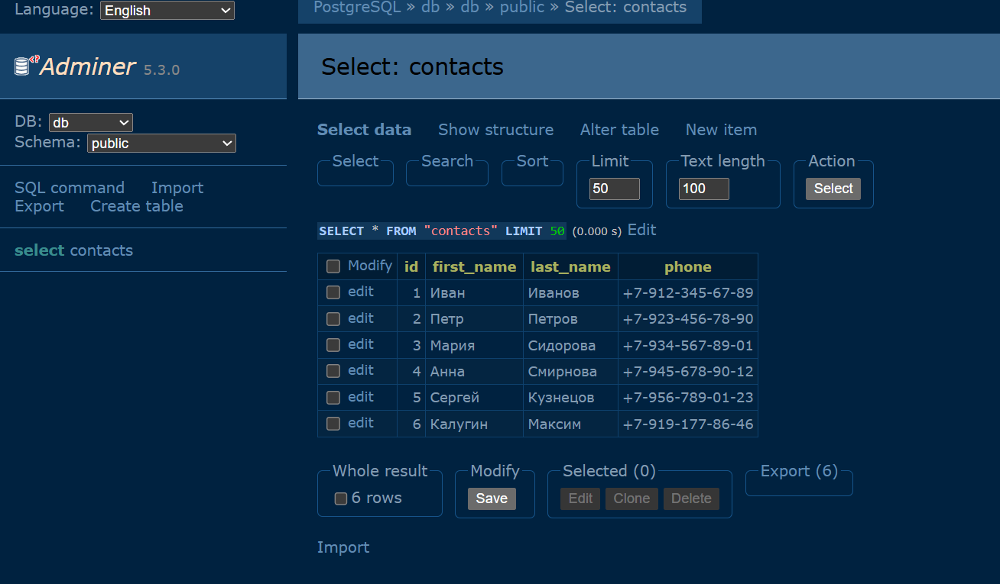

## Java Spring Homework


### Description

Project with application on Spring. Goal of this
project is to improve my Spring knowledge.
All tasks completed according to the `Synergy University`
tasks.

### Task 2:

Создать приложение с помощью `Spring IoC`, чтобы 
познакомиться с основной функциональностью `IoC`, 
на которой строится весь `Spring`.

1) Нужно создать простое приложение (мини чат бот) на Spring,
которое будет выводить в консоль список контактов.

2) При помощи блокнота создать файл contacts.csv и
добавить туда 5 человек. Фамилия, имя, отчество, номер
телефона. Сохранить в виде CSV файла («Сохранить как…»
пишем «contacts.csv» и нажимаем «сохранить»)

Содержимое файла должно получиться примерно следующее:

```text
LastName,FirstName,MiddleName,Phone
Leonov,Alexey,Vladimirovich,79990190299
Ivanov,Oleg,Petrovich,79530191296
Stepanov,Petr,Ivanovich,79881233245
Petrakov,Alexandr,Alexeyevich,79532111296
Ivanova,Oksana,Vladimirocna,79522191213
```

3) Для чтения файла необходимо применить аннотацию @Value,
предварительно ознакомившись с документацией на официальном
сайте Spring.

4) Создать новый интерфейс ContactService и его имплементацию
ContactServiceCsvImpl. Названия метода для поиска контактов
назвать findAll(). В имплементации должна находиться вся логика
по чтению и обработке контактов в CSV файле

5) Все зависимости должны быть настроены в IoC контейнере

6) В консоли нужно вывести список контактов в следующем
формате: «LastName FirstName MiddleName, Phone»

7) Опциональное задание со звездочкой*: приложение
должно корректно запускаться с помощью "java -jar

### Task 3:

1) Нужно подключить `Spring MVC` стартер в проект
2) Создать `CRUD REST API` приложения для сервиса `ContactService`,
который мы делали в прошлом домашнем задании
3) Создать контроллер для получения случайных данных
пользователя. Назвать его `UserController`
4) Добавить несколько spring профилей. Должны быть `dev`, `test`, `prod`.
Запуск каждого профиля реализовать на разных портах.
5) Все зависимости должны быть настроены в `IoC` контейнере
6) Опциональное задание со звездочкой*: нужно
добавить кэширование в `ContactService`. (`spring caching`)

### Task 4:

1) Написать интеграционные тесты для контроллера
получения случайных данных пользователя `UserController`
(`JokeController`)
2) Написать юнит тесты для `CRUD REST API` сервиса 
`ContactService`, который мы делали в 
прошлом домашнем задании
3) Написать `mvc` тесты для `ContactController`, который
мы делали в прошлом домашнем задании
4) исправить все сонар
ошибки, которые у вас есть в проекте. Искать при помощи
плагина в `IDEA SonarLint` с конфигурацией по умолчанию

### Task 5:

1) Нужно подключить `Spring Data` стартер в проект
2) Создать сущность `Contact` и репозиторий `ContactRepository`
3) Написать проливку для сущности `Contact`
4) Написать тесты для `ContactRepository`
5) Подключить `Lombok` и использовать его аннотации в проекте

### Task 6:

1) Нужно подключить аннотацию 
`@EnableTransactionManagement` в проект
2) Добавить транзакции для всех операций 
в `ContactServiceImpl`
3) Использовать свой класс для исключения
в случае возникновения ошибки в транзакции

Структура :

```text
src
├──/main/java/io/mkalugin/synergy/
│    ├── client
│    │     └── JokeClient.java
│    ├── config
│    │     ├── AppConfig.java
│    │     └── FeignConfig.java
│    ├── controller  
│    │     ├── ContactController.java
│    │     └── Joke.java
│    ├── dto
│    │     ├── ContactDto.java
│    │     └── JokeDto.java
│    ├── exception
│    │     ├── ContactLoadingException.java 
│    │     └──TransactionalException.java 
│    ├── model
│    │     └── Contact.java 
│    ├── repository
│    │     └── ContactRepository.java 
│    ├── service
│    │     ├── ContactService.java
│    │     ├── ContactServiceImpl.java 
│    │     ├── JokeService.java
│    │     └── JokeServiceImpl.java    
│    └── SynergyApplication.java
└──/test/java/io/mkalugin/synergy/
     ├── controller
     │     ├── ContactControllerTest.java
     │     └── JokeControllerTest.java
     ├── repository
     │     └── ContactRepositoryTest.java
     └── service
           └──ContactServiceImplTest.java
```

Для проверки необходимо запустить файл 
`SynergyApplication.java`

### Запуск приложения с помошью jar файла:

```bash
    mvn clean package
    java -jar target/synergy-0.0.1-SNAPSHOT.jar
```

### Запуск приложения с профилями:

```bash
    mvn spring-boot:run -D"spring-boot.run.profiles=dev"
    mvn spring-boot:run -D"spring-boot.run.profiles=test"
    mvn spring-boot:run -D"spring-boot.run.profiles=prod"
    mvn spring-boot:run # Дефолтный профиль для локального запуска
```

### Проверка статуса приложения:

```bash
  http://localhost:8080/actuator/health
```

### SonarQube errors:


#### Вывод в консоли (Реализация в рамках task 2):


### Создание контакта в БД :




### Полезные ссылки :

[Ресурсы Spring](https://docs.spring.io/spring-framework/reference/core/resources.html)

[Транзакции в Spring](https://habr.com/ru/articles/682362/)

### Автор : Калугин Максим